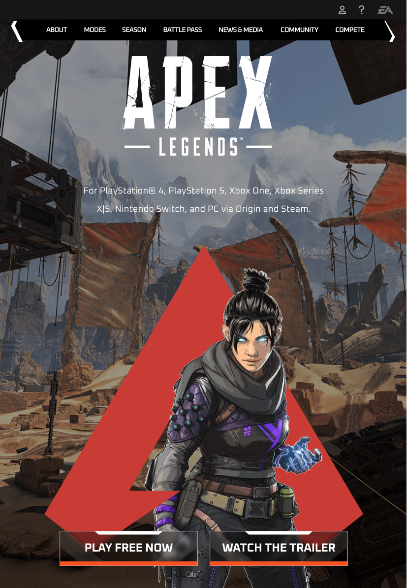
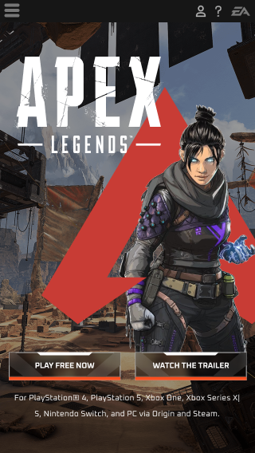

# 🎮 lima-apex


Atividade somatória realizada utilizando **framework** com foco em **responsividade**.

---

## ℹ️ Sobre

Este projeto é uma **Landing Page** inspirada no jogo **Apex Legends**.

Primeiramente, foi **protótipada** no Figma e depois **desenvolvida utilizando principalmente Flexbox**, com auxílio do **Tailwind CSS via CDN**, **sem uso de Node.js ou processos de build**.

O foco principal foi a **responsividade** e a **fidelidade ao layout planejado no protótipo**.

---

## 🎨 Protótipo do projeto no Figma

[Visualizar no Figma](https://www.figma.com/proto/oeGoy5s7UY7SeqLgopUn6k/LIMA-APEX?node-id=0-1&t=q3hH6u8szgHgCUzu-1)

---

## 🛠️ Tecnologias utilizadas

- **HTML**
- **Tailwind CSS (via CDN)**
- **Flexbox**
- **Media Queries**
- **Google Fonts (Oxanium)**

---

## Como executar o projeto localmente

### Pré-requisitos:

- Visual Studio Code (ou outro editor de código de sua preferência)
- Git Bash (ou outro terminal Git)
- Extensão **Live Server** (VS Code)

### Passo a passo:

1. **Clone o repositório:**

```bash
git clone https://github.com/rogeriosrib/lima-apex.git
```

2. **Abra o projeto no VS Code:**

```bash
cd lima-apex
code .
```

3. **Execute com o Live Server:**

- No Visual Studio Code, instale a extensão "Live Server"
- Com o projeto aberto, clique com o botão direito no arquivo `index.html` e clique em **"Go Live"** no canto inferior direito.

---

## 🌐 Como visualizar o projeto sem instalar nada

 Basta acessar:  
[🔗 (GitHub Pages)](https://rogeriosrib.github.io/lima-apex/)

---

### 💻 Tablet:



### 📱 Mobile:



---

## 👨‍💻 Autor do projeto

[**Roger Ribeiro**](https://www.linkedin.com/in/roger-r-de-oliveira-890923353/)

---
